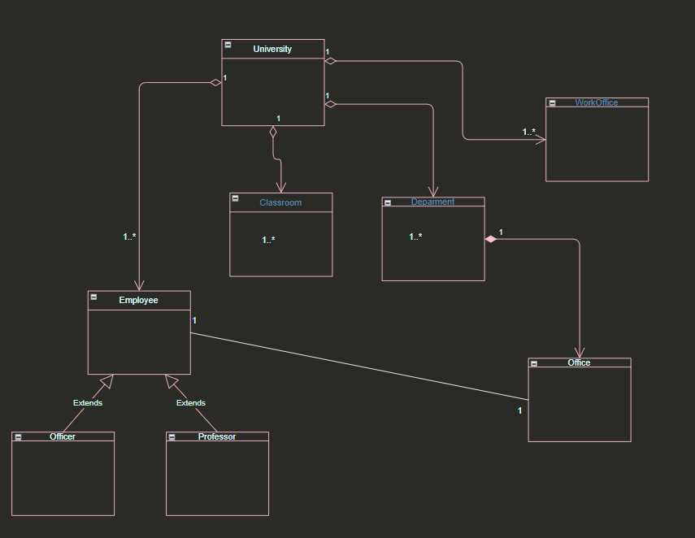

# University Management System

- There are classrooms, study offices and departments belonging to the university.

- There are offices belonging to the departments.

- There are employees belonging to the university. These employees can be professors or civil servants.

- Every employee works in an office..

